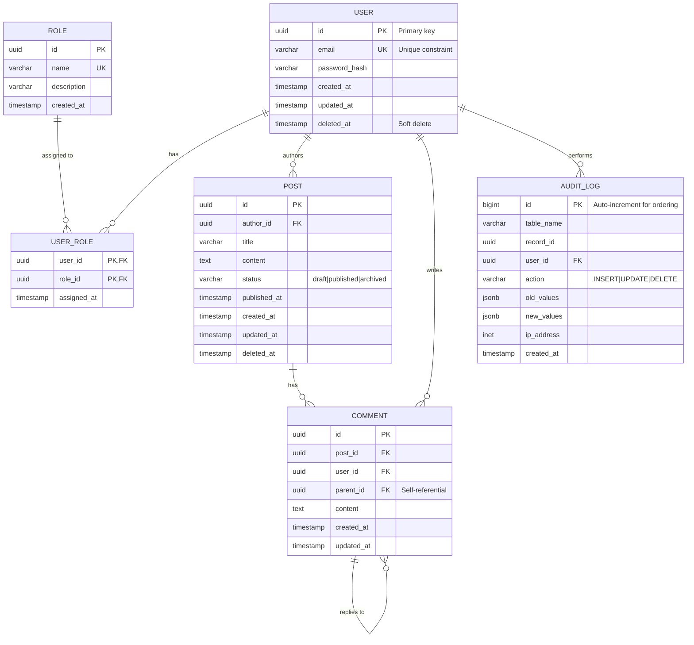
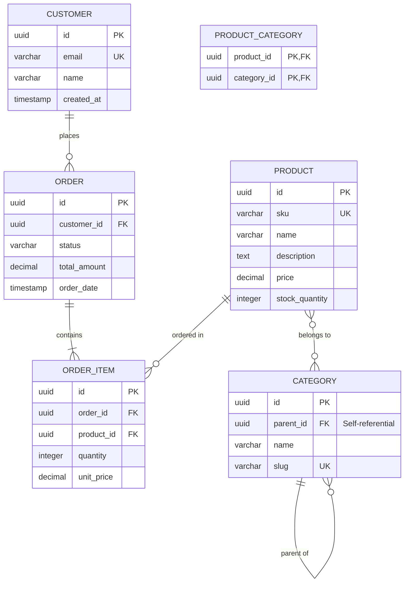
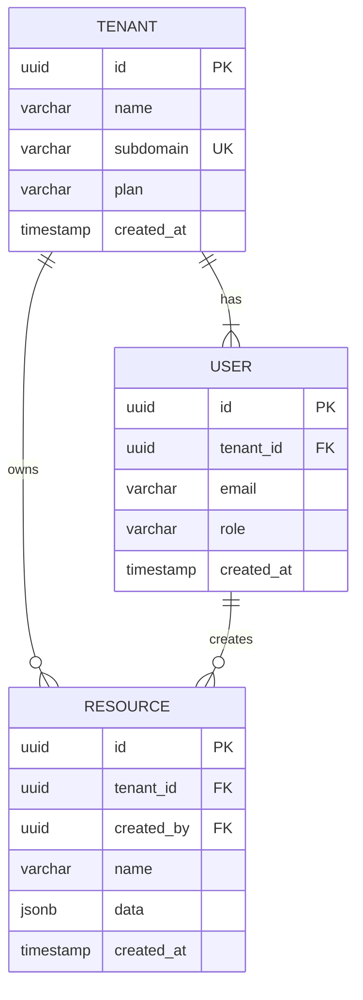

# ERD Template (Mermaid)

## Basic Entity-Relationship Diagram

## Relationship Notations

| Notation | Meaning |
|----------|---------|
| `\|\|--o{` | One-to-Many (required) |
| `\|\|--\|\|` | One-to-One (required) |
| `o\|--o{` | One-to-Many (optional) |
| `}o--o{` | Many-to-Many |

## Attribute Markers

| Marker | Meaning |
|--------|---------|
| `PK` | Primary Key |
| `FK` | Foreign Key |
| `UK` | Unique Key |

## Template Variations

### E-Commerce Domain

### Multi-Tenant SaaS Domain

## Usage Instructions

1. Copy the appropriate template section
2. Modify entity names to match your domain
3. Add/remove attributes as needed
4. Update relationships based on your requirements
5. Use comments (`%%`) to document design decisions
